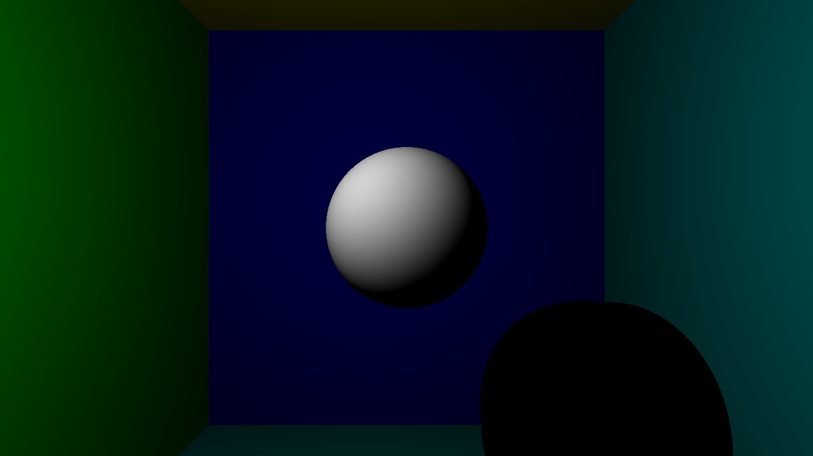

# CudaRayTracing

This is just a simple implementation of the Ray Tracing algorithm on Cuda to see the benefits of parallel computing.

The most difficult part was the dialog between Cuda and OpenGL. The data from the Cuda are retreived as a Pixel Buffer Object and
displayed in the fragment shader.
